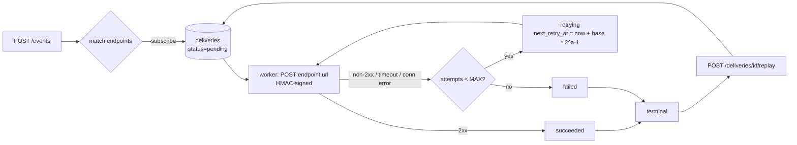
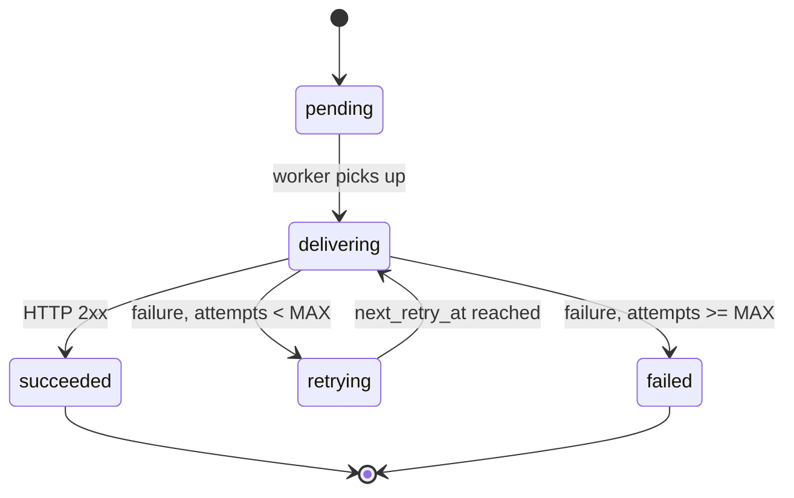

# webhook-engine

[](https://github.com/Gabrielpl-dev/webhook-engine/actions/workflows/ci.yml)

## What it is

A webhook delivery engine in a single process. Clients register HTTP
*endpoints* that subscribe to event *types*, then publish *events*; the engine
persists one *delivery* per (event, endpoint) pair and `POST`s it to the
endpoint, retrying with exponential backoff on failure. It uses only SQLite for
persistence — no Redis, broker, or external database — and guarantees
*at-least-once* delivery with FIFO ordering per endpoint.

## Quickstart

Requires Python 3.11+ and no third-party runtime packages (standard library
only).

```bash
git clone https://github.com/Gabrielpl-dev/webhook-engine.git
cd webhook-engine
./serve --port 8080
```

The server is ready within a few seconds; verify it:

```bash
curl -s http://127.0.0.1:8080/health
```

```json
{"status":"ok"}
```

Run the black-box test suite (it launches `./serve` in subprocesses and talks
HTTP only):

```bash
make test          # python -m unittest discover -s tests
make lint          # ruff check . && ruff format --check .
```

## Examples

All examples below were captured from a live server:

```bash
DATA_DIR=./data WEBHOOK_ALLOW_LOCALHOST=1 ./serve --port 8080
# a local receiver is listening on http://127.0.0.1:19191/hook
```

### `POST /endpoints`

```bash
curl -s -X POST -H 'Content-Type: application/json' \
  -d '{"url":"http://127.0.0.1:19191/hook","events":["order.created","order.paid"]}' \
  http://127.0.0.1:8080/endpoints
```

```json
{"id":"ep_0626effff24ad25908ef617a","url":"http://127.0.0.1:19191/hook","events":["order.created","order.paid"],"secret":"whsec_0e473e133a3c0ebcf57f5c65a1775ed12403379ba99571879e9bf2cdbbdc97d3","created_at":"2026-10-07T11:20:57.634Z"}
```

The `secret` is returned **only here**.

### `GET /endpoints`

```bash
curl -s http://127.0.0.1:8080/endpoints
```

```json
{"endpoints":[{"id":"ep_0626effff24ad25908ef617a","url":"http://127.0.0.1:19191/hook","events":["order.created","order.paid"],"created_at":"2026-10-07T11:20:57.634Z"}]}
```

### `GET /endpoints/{id}`

```bash
curl -s http://127.0.0.1:8080/endpoints/ep_0626effff24ad25908ef617a
```

```json
{"id":"ep_0626effff24ad25908ef617a","url":"http://127.0.0.1:19191/hook","events":["order.created","order.paid"],"created_at":"2026-10-07T11:20:57.634Z"}
```

### `POST /events`

```bash
curl -s -X POST -H 'Content-Type: application/json' \
  -d '{"type":"order.created","payload":{"order_id":"A-1","total":12990}}' \
  http://127.0.0.1:8080/events
```

```json
{"id":"evt_ffcab15b60118340dc17b1da","type":"order.created","payload":{"order_id":"A-1","total":12990},"created_at":"2026-10-07T11:20:57.856Z","deliveries_created":1}
```

### `GET /events/{id}`

```bash
curl -s http://127.0.0.1:8080/events/evt_ffcab15b60118340dc17b1da
```

```json
{"id":"evt_ffcab15b60118340dc17b1da","type":"order.created","payload":{"order_id":"A-1","total":12990},"created_at":"2026-10-07T11:20:57.856Z"}
```

### `GET /endpoints/{id}/deliveries`

```bash
curl -s "http://127.0.0.1:8080/endpoints/ep_0626effff24ad25908ef617a/deliveries"
```

```json
{"deliveries":[{"id":"dlv_3a68842d1724f8588397b944","endpoint_id":"ep_0626effff24ad25908ef617a","event_id":"evt_ffcab15b60118340dc17b1da","status":"succeeded","attempts":1,"last_http_status":200,"last_error":null,"next_retry_at":null,"replayed_from":null,"created_at":"2026-10-07T11:20:57.997Z","updated_at":"2026-10-07T11:20:58.111Z"}],"total":1}
```

### `GET /events/{id}/deliveries`

```bash
curl -s "http://127.0.0.1:8080/events/evt_ffcab15b60118340dc17b1da/deliveries"
```

```json
{"deliveries":[{"id":"dlv_3a68842d1724f8588397b944","endpoint_id":"ep_0626effff24ad25908ef617a","event_id":"evt_ffcab15b60118340dc17b1da","status":"succeeded","attempts":1,"last_http_status":200,"last_error":null,"next_retry_at":null,"replayed_from":null,"created_at":"2026-10-07T11:20:57.997Z","updated_at":"2026-10-07T11:20:58.111Z"}],"total":1}
```

### `POST /deliveries/{id}/replay`

```bash
curl -s -X POST http://127.0.0.1:8080/deliveries/dlv_3a68842d1724f8588397b944/replay
```

```json
{"id":"dlv_a705c9632d3432be9ebceade","endpoint_id":"ep_0626effff24ad25908ef617a","event_id":"evt_ffcab15b60118340dc17b1da","status":"pending","attempts":0,"last_http_status":null,"last_error":null,"next_retry_at":null,"replayed_from":"dlv_3a68842d1724f8588397b944","created_at":"2026-10-07T11:21:02.258Z","updated_at":"2026-10-07T11:21:02.258Z"}
```

### `DELETE /endpoints/{id}`

```bash
curl -s -i -X DELETE http://127.0.0.1:8080/endpoints/ep_0626effff24ad25908ef617a
```

```
HTTP/1.1 204 No Content
Content-Length: 0
```

### Errors

```bash
curl -s -i -X POST -H 'Content-Type: application/json' \
  -d '{"events":["x"]}' http://127.0.0.1:8080/endpoints
```

```
HTTP/1.1 422 Unprocessable Entity
Content-Type: application/json; charset=utf-8
Content-Length: 99

{"error":{"code":"invalid_url","message":"endpoint url must be http(s) and absolute","details":{}}}
```

```bash
curl -s http://127.0.0.1:8080/endpoints/ep_000000000000000000000000
```

```json
{"error":{"code":"not_found","message":"endpoint not found","details":{}}}
```

## Delivery flow



Delivery state machine:



Only one delivery per endpoint is ever in flight, so a slow endpoint creates
*head-of-line blocking* by design: no later delivery for that endpoint is sent
until the current one reaches a terminal state.

## Signature verification

Every delivery `POST` carries these headers (exact capitalization):

```
Content-Type: application/json
X-Webhook-Id: <event_id>
X-Webhook-Timestamp: <unix epoch seconds>
X-Webhook-Signature: sha256=<hex lowercase>
```

The signature is an HMAC-SHA256 over `timestamp + "." + raw_body`:

```python
expected = "sha256=" + hmac.new(
    secret.encode(),
    f"{ts}.".encode() + raw_body,          # raw bytes, never re-serialized
    hashlib.sha256,
).hexdigest()
```

- Use the endpoint `secret` **in full**, including the `whsec_` prefix.
- The separator is a single `.` (U+002E).
- Sign the **raw bytes** exactly as received; do not parse and re-encode the JSON.
- Compare with `hmac.compare_digest`.

Verifiable example (recompute it yourself):

```
secret     = whsec_0e473e133a3c0ebcf57f5c65a1775ed12403379ba99571879e9bf2cdbbdc97d3
timestamp  = 1762430458
body       = {"event_id":"evt_ffcab15b60118340dc17b1da","type":"order.created","payload":{"order_id":"A-1","total":12990},"published_at":"2026-10-07T11:20:57.856Z"}
signed     = 1762430458.{"event_id":"evt_ffcab15b60118340dc17b1da","type":"order.created","payload":{"order_id":"A-1","total":12990},"published_at":"2026-10-07T11:20:57.856Z"}
signature  = sha256=1a26bd8c90a2f35fcf176e1c179b5e962ee4f3d59bc7d046b3e7952c7e7d0c25
```

The delivery body is always:

```json
{"event_id":"evt_ffcab15b60118340dc17b1da","type":"order.created","payload":{"order_id":"A-1","total":12990},"published_at":"2026-10-07T11:20:57.856Z"}
```

## Design decisions

- **SQLite as the queue.** A single-node portfolio service needs durability and
  FIFO ordering, not a distributed broker. SQLite in WAL mode gives both with
  zero operational dependencies; the trade-off is a single writer, which is
  fine at this scale.
- **One delivery in flight per endpoint.** Ordering is a first-class guarantee,
  so `WEBHOOK_WORKER_CONCURRENCY` parallelizes only across *distinct* endpoints.
  This is intentional head-of-line blocking.
- **Backoff without jitter.** Determinism makes retry timing testable
  (`base * 2^(a-1)`); the cost is possible retry synchronization (L-4).
- **At-least-once, idempotent receivers.** A crash after the receiver processes
  a request but before `succeeded` is committed causes a redelivery. Receivers
  should deduplicate on `X-Webhook-Id`, which is stable per event.
- **`delivering` is stored, not in-memory.** It is transient logically but
  persisted so it is visible via the API while in flight; on boot it reverts to
  `retrying` so nothing is lost.

## Configuration

All variables are read once at start-up.

| Variable | Default | Effect |
|---|---|---|
| `DATA_DIR` | `./data` | directory holding `webhooks.db` |
| `WEBHOOK_BACKOFF_BASE_MS` | `1000` | exponential backoff base, in ms (`>= 1`) |
| `WEBHOOK_MAX_ATTEMPTS` | `5` | max attempts per delivery, including the first (`>= 1`) |
| `WEBHOOK_ALLOW_LOCALHOST` | `0` | `1` allows delivery to loopback (`127.0.0.0/8`) |
| `WEBHOOK_TIMEOUT_MS` | `10000` | per-attempt timeout covering connect + send + status header (`>= 1`) |
| `WEBHOOK_WORKER_CONCURRENCY` | `4` | concurrent deliveries across distinct endpoints (`>= 1`) |

`--port N` (default `8080`) and `--data-dir PATH` (overrides `DATA_DIR`) are
also accepted. Invalid ports, an occupied port, an unwritable `DATA_DIR`, or an
out-of-range integer variable cause a message on `stderr` and exit code `1`.

For fast, deterministic tests use `WEBHOOK_BACKOFF_BASE_MS=50` and
`WEBHOOK_MAX_ATTEMPTS=3`.

## API reference

| Method | Path | Success | Notes |
|---|---|---|---|
| `GET` | `/health` | `200` | `{"status":"ok"}` |
| `POST` | `/endpoints` | `201` | returns `secret` once |
| `GET` | `/endpoints` | `200` | ordered by `created_at`, `id` |
| `GET` | `/endpoints/{id}` | `200` | `404` if absent |
| `DELETE` | `/endpoints/{id}` | `204` | cascades to deliveries |
| `GET` | `/endpoints/{id}/deliveries` | `200` | `status`, `limit`, `offset` |
| `POST` | `/events` | `202` | `deliveries_created` |
| `GET` | `/events/{id}` | `200` | `404` if absent |
| `GET` | `/events/{id}/deliveries` | `200` | same filters as above |
| `POST` | `/deliveries/{id}/replay` | `202` | new delivery, `409` if not terminal |

`limit` is clamped without error (`<= 0` → `50`, `> 200` → `200`); `offset < 0`
→ `0`.

### Error catalog

Every error uses the same envelope and `Content-Type: application/json;
charset=utf-8`, including `404` and `405`.

```json
{"error":{"code":"...","message":"...","details":{}}}
```

| HTTP | `code` | When |
|---|---|---|
| `400` | `invalid_json` | malformed body or missing/wrong `Content-Type` |
| `404` | `not_found` | unknown resource or path |
| `405` | `method_not_allowed` | unsupported method on a known path |
| `409` | `conflict` | replay of a delivery in a non-terminal state |
| `413` | `payload_too_large` | serialized `payload` > 262144 bytes |
| `422` | `invalid_url` | missing, relative, or non-http(s) URL |
| `422` | `ssrf_blocked` | loopback host without `WEBHOOK_ALLOW_LOCALHOST=1` |
| `422` | `invalid_events` | empty, non-array, or non-string `events` |
| `422` | `invalid_type` | missing, empty, or > 128-char `type` |
| `422` | `invalid_payload` | missing or non-object `payload` |
| `500` | `internal_error` | unexpected failure |

## Limitations

| # | Limitation |
|---|---|
| L-1 | *At-least-once*: redelivery can occur after a crash; receivers must be idempotent on `X-Webhook-Id`. |
| L-2 | The signing `secret` is stored in plaintext in SQLite — acceptable for a single-node v0.1, not for real production. |
| L-3 | Head-of-line blocking: one slow endpoint delays all later events for that endpoint. |
| L-4 | No jitter and no delay cap in backoff, so retry bursts can synchronize. |
| L-5 | No authentication on the admin API; run it only on a trusted network. |
| L-6 | Single-node: no failover, HA, or horizontal scaling. |
| L-7 | No IPv6 as a delivery target. |

## How this was built

This project was built end-to-end by an internal autonomous agent harness, as
part of its test suite. The spec was written first. The implementation was
produced by an autonomous AI agent (no human code edits). The black-box
acceptance tests were written by **another AI agent, independent of the
implementer**, working only from the spec; they live outside this repository
and are run by the harness. The public `tests/` here mirror the same
acceptance criteria.

Because the tests only ever observe the service over HTTP, they forced several
design choices that are easy to get subtly wrong:

- Every error — including `404` and `405` — must use the JSON error envelope
  with a JSON `Content-Type`, rather than the HTTP server's default HTML pages.
- `attempts` must be **durable**: a delivery killed mid-retry resumes its count
  after restart instead of resetting to zero (AC-15).
- A closed port must classify as `connection_error`, not `timeout`; only an
  accepted connection that then stalls is a `timeout` (AC-8 vs AC-9).
- Replay of a `succeeded` delivery is allowed (`202`) because `succeeded` is
  terminal; only non-terminal states collide with `409` (AC-11).
- Signatures must be computed over the *raw* body bytes with an integer-second
  timestamp, so the body is stored canonically and never re-serialized between
  attempts.

## License

MIT — see [LICENSE](LICENSE).
